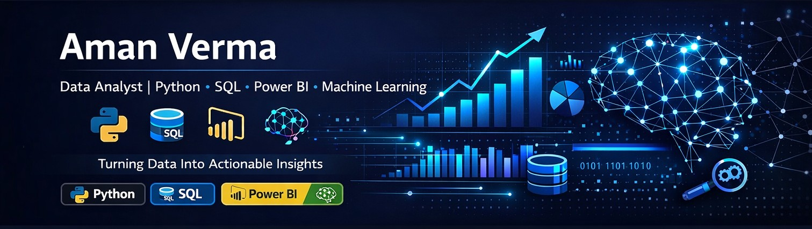

Hi 👋 I'm Aman Verma

📊 Data Analyst | Python | SQL | Power BI | Excel | Machine Learning

Data Analyst skilled in transforming raw data into actionable insights through data cleaning, exploratory data analysis, and interactive dashboards. Experienced in using Python, SQL, Excel, Power BI, and Tableau to analyze datasets and support data-driven decision making.

Previously worked in software testing, which strengthened my understanding of data quality, debugging, and analytical problem solving.

🚀 Currently building real-world analytics projects and seeking opportunities as a Data Analyst

<!--
**amanverma007/amanverma007** is a ✨ _special_ ✨ repository because its `README.md` (this file) appears on your GitHub profile.

Here are some ideas to get you started:

- 🔭 I’m currently working on ...
- 🌱 I’m currently learning ...
- 👯 I’m looking to collaborate on ...
- 🤔 I’m looking for help with ...
- 💬 Ask me about ...
- 📫 How to reach me: ...
- 😄 Pronouns: ...
- ⚡ Fun fact: ...
-->
## 🛠 Skills

Python  
SQL  
Power BI  
Tableau  
Excel  
Statistics  
Machine Learning  
Pandas  
NumPy
Matplotlib

## 📊 GitHub Stats

